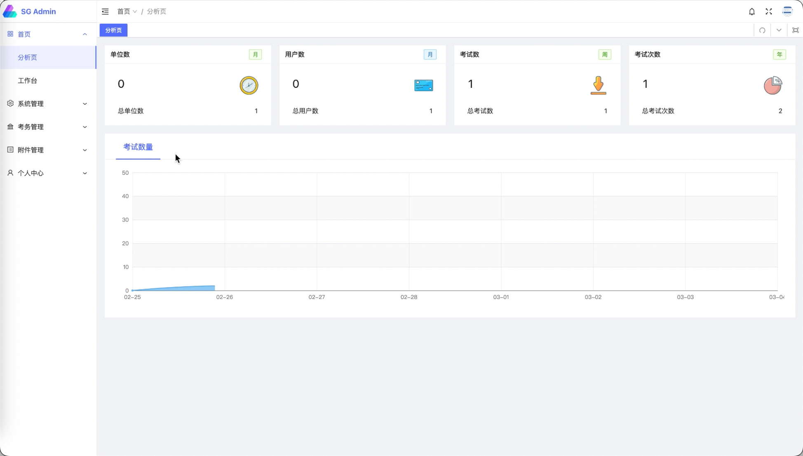
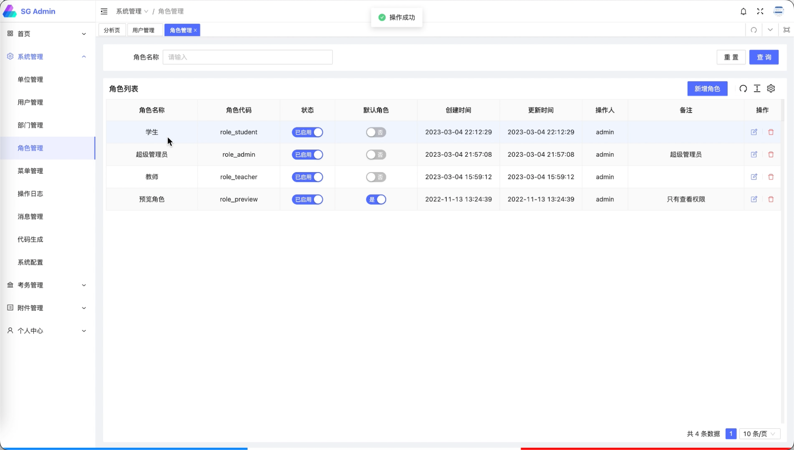
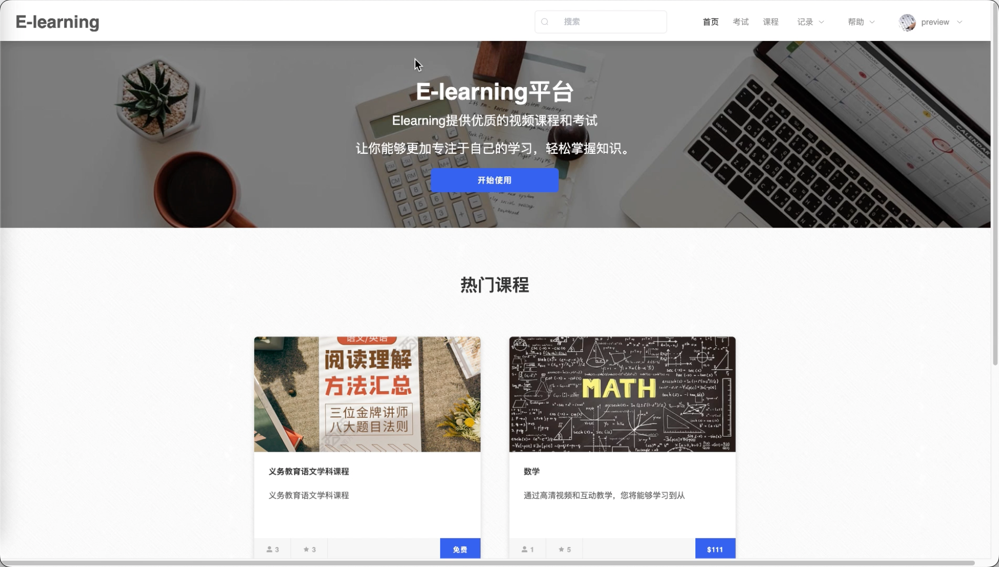
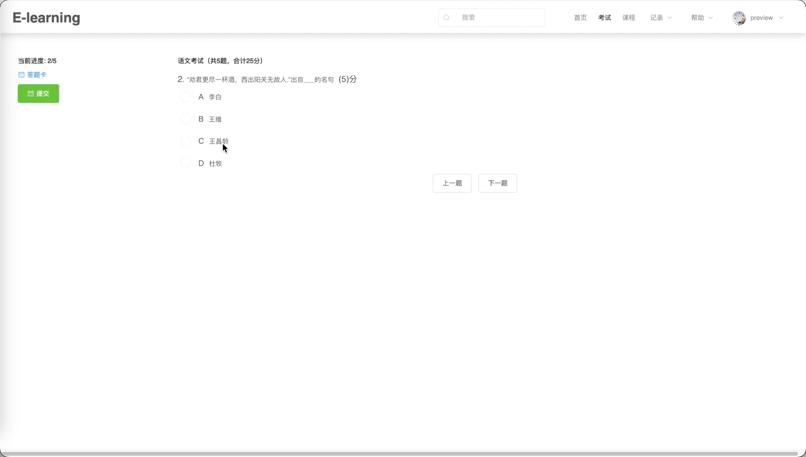
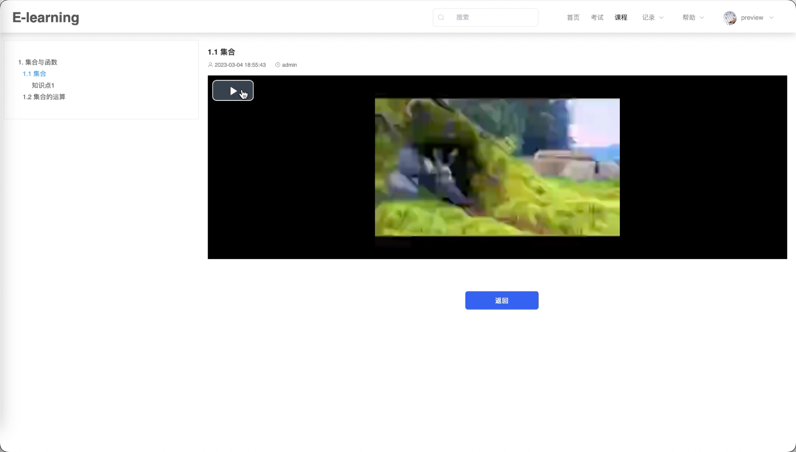
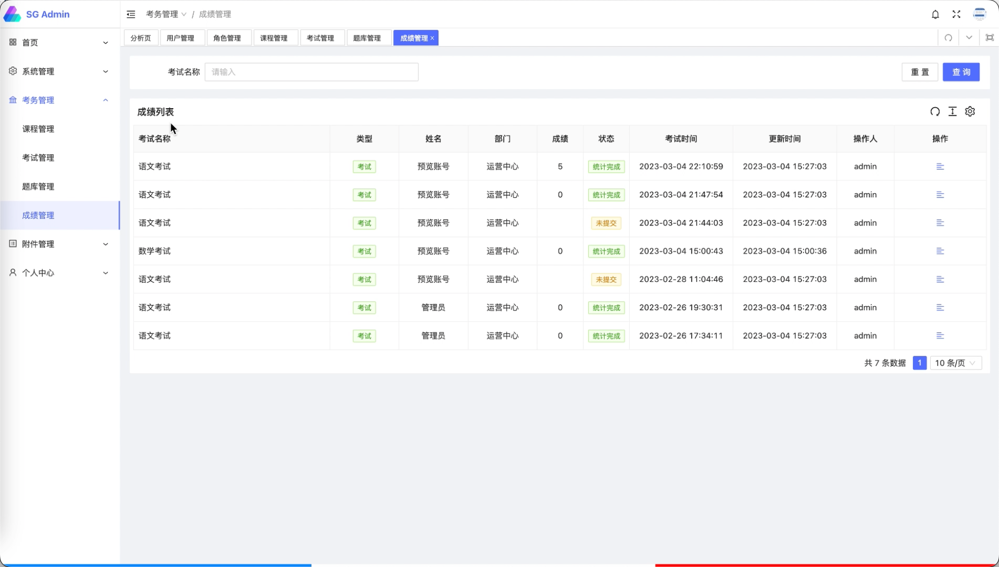

# 基于B/S架构的在线学习平台
## 功能
- 用户管理: 系统设有管理员, 教师, 学生三类用户, 提供灵活的用户权限设置。
- 课程管理: 对课程进行管理, 课程可以播放视频。
- 考试功能: 学生可以在线进行测试, 提交后自动评分, 支持多种题型。

## 技术选型
### 后端
- Java 
- Gradle
- Springboot
- MyBatis
- MySQL

### 用户前端
- Vue2
- ElementUI

### 管理员前端
- Vue3
- AntDesign

## 一键启动方法
切换到项目根目录, 依次执行:

    docker load -i backend-service.tar
    docker load -i frontend-service.tar
    docker-compose up

## 网站访问
用户页面: http://localhost:81
管理员页面: http://localhost:81/admin

## 页面展示
### 管理员页面
#### 管理员控制台

#### 管理员权限管理

### 学生页面
#### 学生主页

#### 学生考试

#### 教学视频播放

#### 考试记录

## 收费服务
可以提供完整源码以及远程线上部署。具体可联系作者adsun526进行咨询, 可以提供项目定制讲解服务。

## 作者联系方式
adsun526

